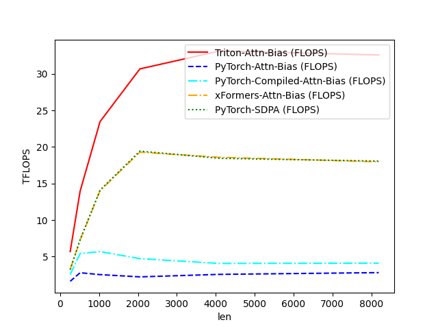
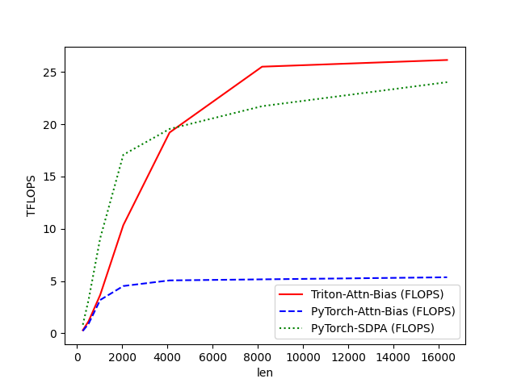

# Flash Attention w. Bias Implementation in Triton

A Triton implementation of Flash Attention with differential bias support. This implementation is inspired by the original [Flash Attention paper](https://arxiv.org/abs/2205.14135).


## Features

- ⚡ Efficient Flash Attention implementation with Triton
- 🎯 Support for matrix-form bias in both forward and backward passes
- 📊 Built-in benchmarking against PyTorch and SDPA implementations
- 🔍 Comprehensive testing for correctness verification
- 📈 Performance optimizations for common use cases

## Requirements

- Python 
- PyTorch
- Triton
- CUDA-capable GPU (tested on A100)

## Installation

```bash
pip install torch triton
```

## Quick Start

```python
import torch
from flash_attn_w_bias import flash_attn_w_bias

# Create input tensors
batch_size, seq_len, n_heads, head_dim = 2, 1024, 8, 64
q = torch.randn(batch_size, seq_len, n_heads, head_dim, device='cuda', dtype=torch.float16)
k = torch.randn_like(q)
v = torch.randn_like(q)
bias = torch.randn(batch_size, n_heads, seq_len, seq_len, device='cuda', dtype=torch.float16)

# Run Flash Attention
output = flash_attn_w_bias(q, k, v, bias, causal=False)
```

## Performance

The implementation shows significant speedups compared to standard PyTorch attention, especially for longer sequence lengths:






```
attention-comparison-batch2-head4-d32-fwd:
      len  Triton-Attn-Bias (FLOPS)  PyTorch-Attn-Bias (FLOPS)
0   256.0                  0.921262                   0.428463
1   512.0                  3.929733                   1.708396
2  1024.0                 14.433682                   5.006561
3  2048.0                 38.961040                   5.240782
4  4096.0                 49.301832                   6.018223
```

## Usage Notes

### Optimal Performance

For best performance:
- Make sequence lengths a multiple of 2
- Use head dimensions ≤ 128
- Test with your specific data shapes before production use
- Consider disabling autotune if experiencing errors

### Known Limitations

- Currently tested primarily on A100 GPUs
- Head dimensions must be ≤ 128
- Supports only fp16 and bf16 dtypes
- Autotune can occasionally introduce race conditions

## Running Tests and Benchmarks

```bash
# Run correctness tests
python flashattn_triton.py

# This will run:
# 1. Correctness tests comparing against PyTorch and SDPA
# 2. Performance benchmarks for various sequence lengths
```

## Implementation Details

The implementation includes several key optimizations:
- Efficient memory access patterns
- Block-wise computation for better cache utilization
- Optimized backward pass with gradient computation for bias
- Configurable block sizes and warps for different hardware

## Contributing

While this is primarily an educational resource, contributions are welcome! Please feel free to:
- Report issues
- Suggest improvements
- Add documentation
- Share benchmark results on different hardware

## Acknowledgments

- @triDao for the original Flash Attention implementation
