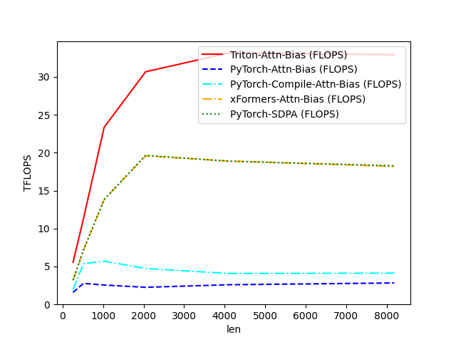
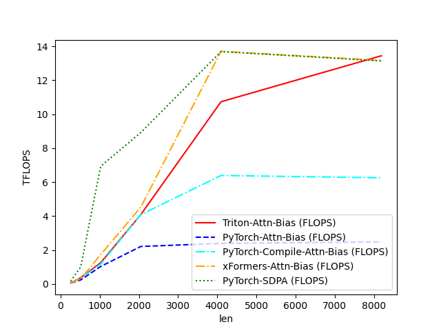

# Flash Attention w. Bias Implementation in Triton

A Triton implementation of Flash Attention with differential bias support. This implementation is inspired by the
original [Flash Attention paper](https://arxiv.org/abs/2205.14135).


## Features

- ⚡ Efficient Flash Attention implementation with Triton
- 🎯 Support for matrix-form bias in both forward and backward passes
- 📊 Built-in benchmarking against PyTorch, PyTorch Compile, xFormers and SDPA implementations
- 🔍 Comprehensive testing for correctness verification
- 📈 Performance optimizations for common use cases

## Requirements

- Python
- PyTorch
- Triton
- xFormers
- CUDA-capable GPU (tested on A100)

## Installation

```bash
pip install torch triton xformers
```

## Quick Start

```python
import torch
from benckmark.attention_func import attention_triton

# Create input tensors
batch_size, seq_len, n_heads, head_dim = 2, 1024, 8, 64
q = torch.randn(batch_size, seq_len, n_heads, head_dim, device='cuda', dtype=torch.float16)
k = torch.randn_like(q)
v = torch.randn_like(q)
bias = torch.randn(batch_size, n_heads, seq_len, seq_len, device='cuda', dtype=torch.float16)

# Run Flash Attention
output = attention_triton(q, k, v, bias, False)
```

## Performance

- The implementation shows significant speedups compared to standard PyTorch attention, especially for longer sequence
  lengths:




- Efficiency Benchmark of Attention Implementations (Forward, Batch=2, Heads=4, HeadDim=32)

| Length | Triton (FLOPS) | PyTorch (FLOPS) | PyTorch-Compile (FLOPS) | xFormers (FLOPS) | PyTorch-SDPA (FLOPS) |
|--------|----------------|-----------------|-------------------------|------------------|----------------------|
| 256    | 5.542667       | 1.574715        | 1.943982                | 3.198991         | 3.192787             |
| 512    | 11.284882      | 2.762875        | 5.355243                | 7.125481         | 7.176634             |
| 1024   | 23.356817      | 2.547090        | 5.691676                | 13.810132        | 13.839005            |
| 2048   | 30.678131      | 2.247875        | 4.738464                | 19.586347        | 19.654297            |
| 4096   | 33.154529      | 2.586121        | 4.071432                | 18.912378        | 18.881439            |
| 8192   | 32.935548      | 2.822556        | 4.118749                | 18.189223        | 18.278633            |

- Efficiency Benchmark of Attention Implementations (Backward, Batch=2, Heads=4, HeadDim=32)

| Length | Triton (FLOPS) | PyTorch (FLOPS) | PyTorch-Compile (FLOPS) | xFormers (FLOPS) | PyTorch-SDPA (FLOPS) |
|--------|----------------|-----------------|-------------------------|------------------|----------------------|
| 256    | 0.073699       | 0.062677        | 0.076821                | 0.077729         | 0.168817             |
| 512    | 0.371210       | 0.242403        | 0.348554                | 0.306856         | 1.007847             |
| 1024   | 1.257951       | 1.036895        | 1.181298                | 1.738618         | 6.938603             |
| 2048   | 4.089672       | 2.213153        | 4.083681                | 4.527996         | 8.918591             |
| 4096   | 10.732837      | 2.395701        | 6.392552                | 13.702077        | 13.685270            |
| 8192   | 13.440012      | 2.485934        | 6.257983                | 13.159468        | 13.134775            |

## Usage Notes

### Optimal Performance

For best performance:

- Make sequence lengths a multiple of 2
- Use head dimensions ≤ 128
- Test with your specific data shapes before production use
- Consider disabling autotune if experiencing errors

### Known Limitations

- Currently tested primarily on A100 GPUs
- Head dimensions must be ≤ 128
- Supports only fp16 and bf16 dtypes
- Autotune can occasionally introduce race conditions

## Running Tests and Benchmarks

```bash
# Run correctness tests
python flashattn_triton.py

# This will run:
# 1. Correctness tests comparing against PyTorch, PyTorch Compile, xFormers and SDPA
# 2. Performance benchmarks for various sequence lengths
```

## Implementation Details

The implementation includes several key optimizations:

- Efficient memory access patterns
- Block-wise computation for better cache utilization
- Optimized backward pass with gradient computation for bias
- Configurable block sizes and warps for different hardware

## Contributing

While this is primarily an educational resource, contributions are welcome! Please feel free to:

- Report issues
- Suggest improvements
- Add documentation
- Share benchmark results on different hardware

## Acknowledgments

- @triDao for the original Flash Attention implementation
